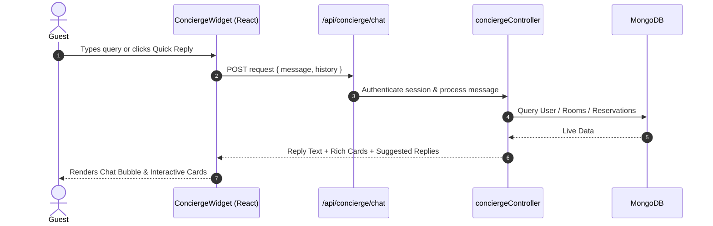

# 🤖 Velora Virtual Concierge — Presentation Overview

> **Executive Summary:** A full-stack Virtual Concierge built into Velora Hotel System providing instant guest assistance, automated FAQ answers, reservation lookup, and dynamic room recommendations with rich UI cards.

---

## 🧠 What AI/Intelligence Architecture is Used?

The chatbot uses a **Hybrid Rule-Based NLP & Algorithmic Recommendation Engine**. 

Instead of external LLMs (like OpenAI or Gemini) which introduce monthly API fees and potential AI hallucinations, Velora uses an **in-house, database-driven intelligence system**:

```
[ User Message ] ──► 1. Intent & Entity Extractor (Matches Intent + Parses Guest Count/Tags)
                        │
                        ▼
                     2. Database Query Engine (Live Mongoose Connection to MongoDB)
                        │
                        ▼
                     3. Dynamic Ranking & Rationale Generator (Calculates Best Fit)
                        │
                        ▼
                     [ Response Payload + Rich Cards ]
```

### 💡 Core Advantages for the Hotel:
- ⚡ **Zero Latency (Instant Responses):** Direct database processing with zero network overhead.
- 💰 **$0 Running Cost:** No per-token API charges or external subscriptions.
- 🎯 **0% Hallucinations:** Guarantees 100% accurate room rates, room numbers, and policy information.
- 🔒 **100% Privacy:** Guest data never leaves the server or gets sent to third-party AI companies.

---

## 🎯 Key Features & Capabilities

- 🔑 **Guest Reservation Lookup:** Authenticated guests view live booking details, room numbers, and stay dates.
- ℹ️ **Hotel FAQ & Policy Engine:** Instant answers for Check-in/out times, Breakfast, Spa, Pool, and Wifi.
- 🏨 **Dynamic Room Recommendation:** Smart room matching based on guest count, budget, or luxury/honeymoon preferences.
- 🃏 **Rich UI Card Attachments:** Interactive cards for rooms (with images, rates, floor #) and reservation badges.

---

## 🏗️ Architecture & Data Flow



---

## 🛠️ The 4 Technical Layers

| Layer | File / Module | What It Does |
| :--- | :--- | :--- |
| **1. UI Widget** | [`ConciergeWidget.tsx`](file:///c:/Users/mhmda/OneDrive/Desktop/hotel_system/src/components/concierge/ConciergeWidget.tsx) | Floating chat drawer, typing indicator, auto-scroll, rich cards, quick reply buttons. |
| **2. API Route** | [`route.ts`](file:///c:/Users/mhmda/OneDrive/Desktop/hotel_system/src/app/api/concierge/chat/route.ts) | Serverless POST route, checks user authentication session. |
| **3. Intent Engine** | [`conciergeController.ts`](file:///c:/Users/mhmda/OneDrive/Desktop/hotel_system/src/backend/controllers/conciergeController.ts) | Keyword intent classifier, database search, room recommendation algorithm. |
| **4. Database** | `MongoDB` (Mongoose) | Provides live data from `User`, `Reservation`, `Room`, `RoomType`, `Amenity`. |

---

## 💡 3 Main Intents

```
[ User Input ]
      │
      ├── 1. Booking Query ("my room") ──► Auth Check ──► Fetch User Bookings (Reservation Cards)
      │
      ├── 2. Hotel Policy ("check in")  ──► Match Keyword ──► Instant FAQ Response
      │
      └── 3. Room Search ("for 4 guests") ──► Parse Capacity/Price ──► Rank Top 4 Rooms (Room Cards)
```

1. **Guest Booking Lookup:** Shows current stays and assigned room numbers.
2. **Hotel Policy FAQs:** Instant responses for check-in (3 PM), check-out (11 AM), breakfast hours (6:30-10:30 AM), etc.
3. **Smart Room Search:** Filters active rooms by capacity and budget/luxury tags, returning top 4 rooms with direct booking links.

---

## 🏆 Presentation Highlights

- ⚡ **Zero Friction:** Available across all pages via global layout provider.
- 🎨 **Luxury Aesthetic:** Styled with Velora's dark slate (`#1A1918`) and gold (`#C5A46D`) theme.
- 🔐 **Secure:** User booking access is strictly protected by session authentication.
